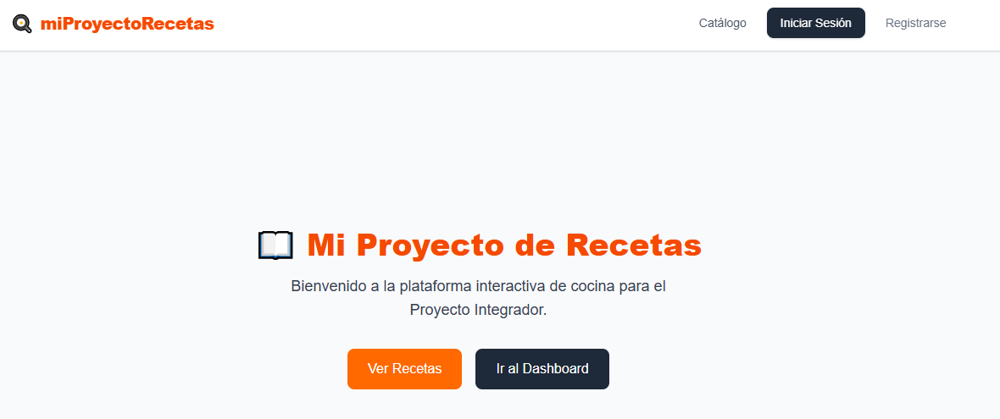
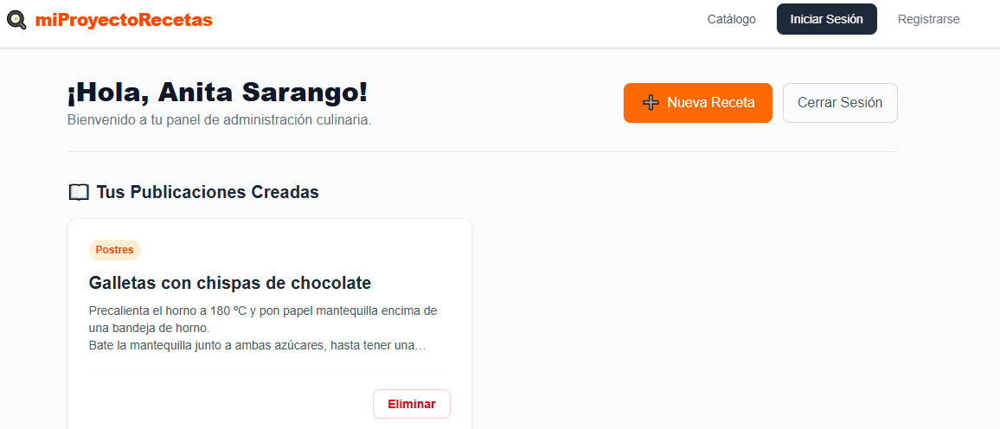

# 🍳 Mi Proyecto de Recetas

Plataforma Interactiva de Cocina 

## Demo en vivo:

https://mi-proyecto-recetas.vercel.app

## Capturas de pantalla

| Imagen 1 | Imagen 2 |
| :---: | :---: |
|  |  |

## Start Tecnologico
- Next.js
- TypeScript
- Talwind CSS
- SupaBase
- Vercel

## Roles de usuarios
- ROL 1:  LECTOR
  Buscar recetas - Guardar Favoritos

- ROL 2:  CHEF
  Publica - Edita y Elimina sus propias recetas

## Credenciales de Prueba
- ROL1: anitasarango@gmail.com  / clave123
- ROL2: samyyazan@gmail.com  / clave123

## Getting Started

First, run the development server:

```bash
npm run dev
# or
yarn dev
# or
pnpm dev
# or
bun dev
```

Open [http://localhost:3000](http://localhost:3000) with your browser to see the result.

You can start editing the page by modifying `app/page.tsx`. The page auto-updates as you edit the file.

This project uses [`next/font`](https://nextjs.org/docs/app/building-your-application/optimizing/fonts) to automatically optimize and load [Geist](https://vercel.com/font), a new font family for Vercel.

## Learn More

To learn more about Next.js, take a look at the following resources:

- [Next.js Documentation](https://nextjs.org/docs) - learn about Next.js features and API.
- [Learn Next.js](https://nextjs.org/learn) - an interactive Next.js tutorial.

You can check out [the Next.js GitHub repository](https://github.com/vercel/next.js) - your feedback and contributions are welcome!

## Deploy on Vercel

The easiest way to deploy your Next.js app is to use the [Vercel Platform](https://mi-proyecto-recetas.vercel.app/) from the creators of Next.js.

Check out our [Next.js deployment documentation](https://nextjs.org/docs/app/building-your-application/deploying) for more details.
